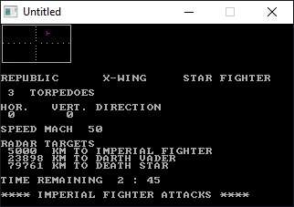

[Home](https://qb64.com) • [News](../../news.md) • [GitHub](https://github.com/QB64Official/qb64) • [Wiki](https://github.com/QB64Official/qb64/wiki) • [Samples](../../samples.md) • [InForm](../../inform.md) • [GX](../../gx.md) • [QBjs](../../qbjs.md) • [Community](../../community.md) • [More...](../../more.md)

## SAMPLE: X-WING



### Author

[🐝 DATATECH](../datatech.md) 

### Description

```text
PRINT "ÚÄÄÄÄÄÄÄÄÄÄÄÄÄÄÄÄÄÄÄÄÄÄÄÄÄÄÄÄÄÄÄÄÄÄÄÄÄÄ¿"
PRINT "³ÚÄÄÄÄÄÄÄÄÄÄÄÄÄÄÄÄÄÄÄÄÄÄÄÄÄÄÄÄÄÄÄÄÄÄÄÄ¿³"
PRINT "³³                                    ³³"
PRINT "³³             2060-A.BAS             ³³"
PRINT "³³               XWING                ³³"
PRINT "³³                                    ³³"
PRINT "³³     BROUGHT TO YOU BY DATATECH     ³³"
PRINT "³³                                    ³³"
PRINT "³³    MICHAEL KNOX WAUSAU WI 54403    ³³"
PRINT "³³                                    ³³"
PRINT "³³                                    ³³"
PRINT "³³       MODIFIED BY GALLEON TO       ³³"
PRINT "³³        BE QBASIC COMPATIBLE        ³³"
PRINT "³³                                    ³³"
PRINT "³³                                    ³³"
PRINT "³³    QB64 DEMO #5: X-WING FIGHTER    ³³"
PRINT "³³                                    ³³"
PRINT "³³                                    ³³"
PRINT "³ÀÄÄÄÄÄÄÄÄÄÄÄÄÄÄÄÄÄÄÄÄÄÄÄÄÄÄÄÄÄÄÄÄÄÄÄÄÙ³"
PRINT "ÀÄÄÄÄÄÄÄÄÄÄÄÄÄÄÄÄÄÄÄÄÄÄÄÄÄÄÄÄÄÄÄÄÄÄÄÄÄÄÙ"
```

### QBjs

> Please note that QBjs is still in early development and support for these examples is extremely experimental (meaning will most likely not work). With that out of the way, give it a try!

* [LOAD "xwing.bas"](https://qbjs.org/index.html?src=https://qb64.com/samples/x-wing/src/xwing.bas)
* [RUN "xwing.bas"](https://qbjs.org/index.html?mode=auto&src=https://qb64.com/samples/x-wing/src/xwing.bas)
* [PLAY "xwing.bas"](https://qbjs.org/index.html?mode=play&src=https://qb64.com/samples/x-wing/src/xwing.bas)

### File(s)

* [xwing.bas](src/xwing.bas)

🔗 [game](../game.md), [star wars](../star-wars.md), [legacy](../legacy.md)
