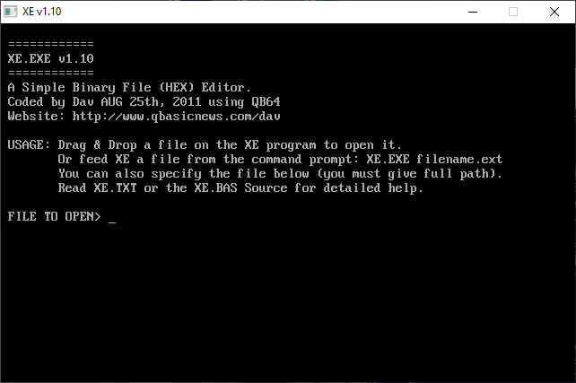

[Home](https://qb64.com) • [News](../../news.md) • [GitHub](https://github.com/QB64Official/qb64) • [Wiki](https://github.com/QB64Official/qb64/wiki) • [Samples](../../samples.md) • [InForm](../../inform.md) • [GX](../../gx.md) • [QBjs](../../qbjs.md) • [Community](../../community.md) • [More...](../../more.md)

## SAMPLE: XE HEX EDITOR



### Author

[🐝 Dav](../dav.md) 

### Description

```text
'============
'XE.BAS v1.10
'============
'A simple Binary File (HEX) editor.
'Coded by Dav on AUG 25, 2011 using QB64.
'Visit my website for more sourcecode at:
'http://www.qbasicnews.com/dav
'
'==========================================================================
'* * * *          USE THIS PROGRAM AT YOUR OWN RISK ONLY!!          * * * *
'==========================================================================
'
' New in XE v1.10:
' ~~~~~~~~~~~~~~~
'
' * ADDED: Now can View/Edit files in TWO modes - HEX (default) or ASCII.
'          ASCII mode allows for faster browsing through the file.
'          Toggle between HEX/ASCII mode by pressing ENTER while viewing.
' * ADDED: Shows Usage information when starting, added help in source.
' * ADDED: Now shows currently opened file in the TITLE menu (full name).
'          Short filename (8.3) is shown at top left line, after FILE:
' * ADDED: Now Uses Win API to test for file instead of using TEMP files.
' * ADDED: Can open file on READ-ONLY medium like CD's (because of above).
' * FIXED: Fixed error in FILTER that prevented letters from showing.
' * FIXED: Fixed several display bugs, and tweaked the layout more.
```

### QBjs

> Please note that QBjs is still in early development and support for these examples is extremely experimental (meaning will most likely not work). With that out of the way, give it a try!

* [LOAD "xe.bas"](https://qbjs.org/index.html?src=https://qb64.com/samples/xe-hex-editor/src/xe.bas)
* [RUN "xe.bas"](https://qbjs.org/index.html?mode=auto&src=https://qb64.com/samples/xe-hex-editor/src/xe.bas)
* [PLAY "xe.bas"](https://qbjs.org/index.html?mode=play&src=https://qb64.com/samples/xe-hex-editor/src/xe.bas)

### File(s)

* [xe.bas](src/xe.bas)

🔗 [editor](../editor.md), [hex](../hex.md)
