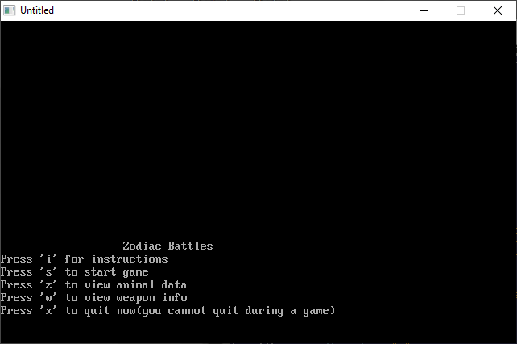

[Home](https://qb64.com) • [News](../../news.md) • [GitHub](https://github.com/QB64Official/qb64) • [Wiki](https://github.com/QB64Official/qb64/wiki) • [Samples](../../samples.md) • [InForm](../../inform.md) • [GX](../../gx.md) • [QBjs](../../qbjs.md) • [Community](../../community.md) • [More...](../../more.md)

## SAMPLE: ZODIAC



### Author

[🐝 Paulunknown](../paulunknown.md) 

### Description

```text
PRINT "Game created by Paulunknown"
PRINT "Thanks for playing. Please give me some comments on this."
PRINT "                                                          "
PRINT "Also, I wish I could get some graphics in this game but I barely know"
PRINT "the basics of creating pictures. I really need some help on that."
PRINT "                                                                  "
PRINT "Feel free to tell a friend about this or send it to them. This is "
PRINT "probably my first game."
```

### QBjs

> Please note that QBjs is still in early development and support for these examples is extremely experimental (meaning will most likely not work). With that out of the way, give it a try!

* [LOAD "zodiac4.bas"](https://qbjs.org/index.html?src=https://qb64.com/samples/zodiac/src/zodiac4.bas)
* [RUN "zodiac4.bas"](https://qbjs.org/index.html?mode=auto&src=https://qb64.com/samples/zodiac/src/zodiac4.bas)
* [PLAY "zodiac4.bas"](https://qbjs.org/index.html?mode=play&src=https://qb64.com/samples/zodiac/src/zodiac4.bas)

### File(s)

* [zodiac4.bas](src/zodiac4.bas)

🔗 [game](../game.md), [legacy](../legacy.md)
